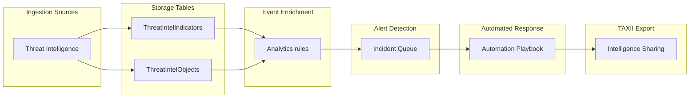

# Understanding STIX and TAXII in Microsoft Sentinel

## Overview

Before diving into implementation, it's essential to understand the foundations of STIX and TAXII, and how they integrate with Microsoft Sentinel. This chapter provides the conceptual framework you'll need for all subsequent chapters.

## What is STIX?
STIX (Structured Threat Information eXpression) is a standardized language for describing cybersecurity threat information. Think of it as a common vocabulary or Body of Knowledge that allows security teams to share threat intelligence in a consistent, machine-readable format.

### STIX 2.1 Objects in Microsoft Sentinel

> [!NOTE]  
> As of April 2025, Microsoft Sentinel supports the following STIX 2.1 objects:
> - Indicators: Observable patterns that indicate malicious activity (IPs, domains, file hashes)
> - Threat Actors: Individuals or groups conducting malicious activities
> - Attack Patterns: Methods and techniques used by adversaries (aligned with MITRE ATT&CK)
> - Identities: Organizations, individuals, or systems targeted by threats
> - Relationships: Connections between STIX objects (e.g., 'Threat Actor uses Attack Pattern')

> [!IMPORTANT]  
> Microsoft introduced two new tables in April 2025: ThreatIntelIndicators and ThreatIntelObjects. The legacy ThreatIntelligenceIndicator table will be deprecated on July 31, 2025. All custom queries, analytics rules, and workbooks must be migrated to the new tables by this date.

## What is TAXII?

TAXII (Trusted Automated eXchange of Intelligence Information) is a protocol for exchanging cyber threat intelligence. If STIX is the language, TAXII is the transport mechanism that delivers it.

### TAXII 2.x Architecture

TAXII 2.x uses a client-server model with these key components:

- API Root: The base URL that hosts threat intelligence collections:
  - Common default is `taxii2/root`, but can also other like `taxii1/api`.
- Collections: Groups of threat intelligence objects (like folders):
  - Collections are referenced by `ID` which is UUIDv4 formatted, such as `a08566d0-8ae0-4004-8dfb-655e891ca876`.
- Discovery Endpoint: URL that advertises available API Endpoints:
  - Default is `taxii2`. Use `GET` to display the available API Root endpoints.
  - With the API Root you can display the available collections using `GET` `taxii2/root/collections`.
- Collection Objects: URL that provides access to the specific collection objects:
  - Combining all examples the collection endpoint is `taxii2/root/collections/a08566d0-8ae0-4004-8dfb-655e891ca876/objects`.
 
## Microsoft Sentinel's STIX/TAXII Integration

Microsoft Sentinel provides multiple ways to work with the STIX/TAXII Standard.

**Threat Intelligence - TAXII Data Connector**
  - Imports threat indicators from TAXII 2.0 and 2.1 servers
  - Supports multiple collections from multiple servers
  - Polls for new indicators based on your configured frequency
  - Stores indicators in ThreatIntelIndicators table
    
**Threat Intelligence Upload API**
  - REST API for programmatic STIX object upload
  - Supports all STIX 2.1 objects (indicators, threat actors, relationships, etc.)
  - Workspace-scoped endpoint with granular permissions
  - Does not require a data connector

**Threat Intelligence - TAXII Export Connector**
  - Exports threat intelligence from Sentinel to external TAXII 2.1 servers
  - Enables bi-directional intelligence sharing
  - Supports scheduled or on-demand exports

**Microsoft Defender Threat Intelligence (MDTI)**
  - Built-in feed from Microsoft's threat intelligence platform
  - No configuration required beyond enabling the connector
  - Provides indicators at no additional cost

## The Unified Security Operations Portal

Microsoft's unified security operations platform (accessible via the Microsoft Defender portal at https://security.microsoft.com) brings together threat intelligence management with other security capabilities:
  - Unified Incidents: Correlates TI with XDR and SIEM alerts
  - Advanced Hunting: Query threat intelligence alongside device, identity, and email data
  - Threat Intelligence Management: Create, curate, and establish relationships between objects
  - Attack Disruption: Automatically responds to detected threats using TI context

## Key Concepts and Terminology

| **Term**          | **Definition**                                                                                    |
| ----------------- | ------------------------------------------------------------------------------------------------- |
| **IOC**           | Indicator of Compromise - observable artifacts that suggest malicious activity                    |
| **TIP**           | Threat Intelligence Platform - aggregates and curates threat intelligence from multiple sources   |
| **TLP**           | Traffic Light Protocol - classification scheme for sharing sensitivity (CLEAR, GREEN, AMBER, AMBER+STRICT, RED) |
| **API Root**      | Base URL in TAXII that hosts collections of threat intelligence                                   |
| **Collection ID** | Unique identifier (UUIDv4) for a group of threat intelligence objects within an API root          |

## Understanding how threat intelligence flows through Microsoft Sentinel

Below the event flow of threat intelligence.

1. Ingestion: Threat intelligence enters via TAXII connectors, Upload API, or MDTI.
2. Storage: Data is stored in ThreatIntelIndicators and ThreatIntelObjects tables.
3. Enrichment: Analytics rules correlate TI with other data sources (logs, alerts).
4. Detection: Matches generate alerts and incidents in the unified incident queue.
5. Response: Automated playbooks can act on TI-enriched incidents.
6. Export: Intelligence can be shared externally via TAXII export.

## Quick Reference: Portal Locations

| **Feature**         | **Azure Portal**                        | **Defender Portal**                                       |
| ------------------- | --------------------------------------- | --------------------------------------------------------- |
| Data Connectors     | Configuration > Data connectors         | Microsoft Sentinel > Content management > Data connectors |
| Threat Intelligence | Threat management > Threat intelligence | Threat intelligence > Intel management                    |
| Advanced Hunting    | Hunting > Advanced hunting              | Investigation & response > Hunting > Advanced hunting     |

## References
| **Resource**                                  | **Link**                                                                                                                                                                 |
| --------------------------------------------- | ------------------------------------------------------------------------------------------------------------------------------------------------------------------------ |
| **Threat Intelligence in Microsoft Sentinel** | [https://learn.microsoft.com/en-us/azure/sentinel/understand-threat-intelligence](https://learn.microsoft.com/en-us/azure/sentinel/understand-threat-intelligence)       |
| **STIX/TAXII Feeds Integration**              | [https://learn.microsoft.com/en-us/azure/sentinel/connect-threat-intelligence-taxii](https://learn.microsoft.com/en-us/azure/sentinel/connect-threat-intelligence-taxii) |
| **Unified Security Operations Overview**      | [https://learn.microsoft.com/en-us/unified-secops/overview-unified-security](https://learn.microsoft.com/en-us/unified-secops/overview-unified-security)                 |
| **OASIS STIX 2.1 Specification**              | [https://docs.oasis-open.org/cti/stix/v2.1/stix-v2.1.html](https://docs.oasis-open.org/cti/stix/v2.1/stix-v2.1.html)                                                     |

## Key Takeaways

- STIX provides a standard vocabulary for threat intelligence; TAXII provides the transport
- Microsoft Sentinel supports STIX 2.1 with five main object types plus relationships
- New tables (ThreatIntelIndicators, ThreatIntelObjects) replace the legacy table by July 2025
- The unified Defender portal combines TI management with XDR and SIEM capabilities
- Multiple integration methods exist: TAXII connector, Upload API, MDTI, and TIP connector
